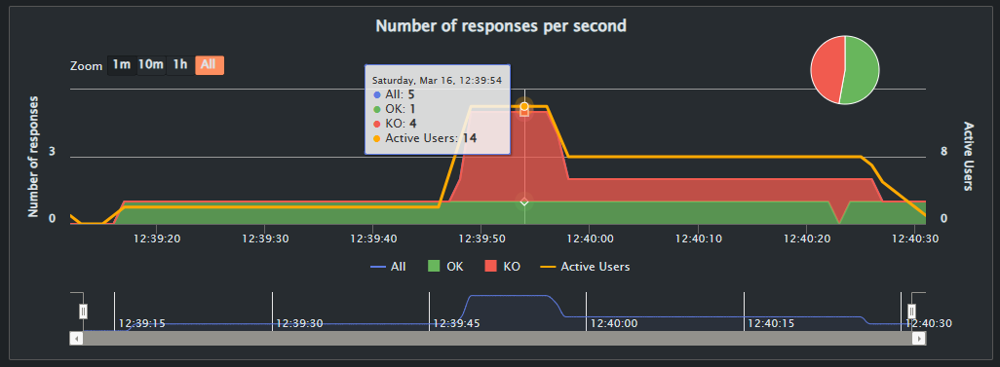
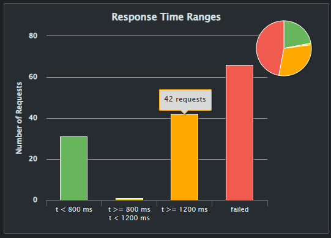

# SportApp - Servicio de Registro de Usuarios - Equipo 13

El propósito de este experimento es probar de la arquitectura diseñada para el servicio de registro de usuarios favoreciendo la disponibilidad, deteccion de falla, respuesta de la falla y enmascaramiento de la falla, desfavoreciendo el tiempo de respuesta, cohesión, Testeabilidad(Complejas). Se espera que en caso de que el servicio de registro de usuarios falle se activa un servicio de respaldo para el registro de usuarios, para esto se utiliza las herramientas: Docker, NGINX, Flask, python, Gatling y SQLite.

Este experimento esta relacionado con la [HU006](https://github.com/AfLosada/ArquitecturasAgiles-G13/issues/9),  que tiene como punto de sensibilidad la disponibilidad del servicio de registro de usuarios que tiene un alto grado de insertidumbre, para esto utilizaremos un estilo de arquitectura de microservicios.

Se utilizan las tacticas de Arquitectura:

* Monitor (Ping - Echo) : Detección de fallas de disponibilidad del servicio de registro de usuarios.

* CQRS : Separación de responsabilidades. La idea es tener diferentes servicios para consultas y para comandos. En este caso los comandos van al servicio de registro de usuarios y las consultas al servicio de consulta de usuarios.

* Redundancia Pasiva con Resincronización de Estado : Recuperación. Cuando se detecte un fallo en el registro de usuarios se creará una nueva instancia del microservicio de registro de usuarios que se encargará de recibir los llamados mientras se reinicia el servicio principal.

Listado de componentes (Microservicios).
| Microservicio | Proposito y comportamiento esperado | Tecnología Asociada |
|-|-|-|
| Registro de Usuarios | Maneja los comandos relacionados a la entidad de usuarios, en este caso su registro | Flask |
| Consulta de Usuarios | Maneja las consultas relacionadas a la entidad de usuarios. | Flask |
| API Gateway | Maneja la interacción con usuarios, enruta las conexiones al servicio que le corresponda. | NGINX |
| Monitor | Revisa si los microservicios, en este caso el de registro de usuarios, se encuentra vivo | Python/Bash |
| Base de Datos | Guarda los registros de usuarios y permite consultarlos. | SQLite |

# Arquitectura de despliegue:


## Instalación

Como primera medida para la instalacion se debe contar con la instalacion completa de Docker para la cual pueden seguir esta guias: [Windows](https://docs.docker.com/desktop/install/windows-install/), [Mac](https://docs.docker.com/desktop/install/mac-install/) o [Linux](https://docs.docker.com/desktop/install/linux-install/).

Despues de tener instalado docker se debe clonar este repositorio a su ambiente local utilizando:

```
git clone https://github.com/AfLosada/ArquitecturasAgiles-G13
```


Para correr la aplicación se debe ejecutar el siguiente comando dentro de la ubicacion del repositorio en la carpeta experimento-1:


```
docker-compose up
```

O si prefiere correr la aplicación en background se debe ejecutar el siguiente comando:

```
docker-compose up -d
```

Con estos pasos realizamos la instalacion y ejecucion de los microservicios de la arquitectura diseñada para el registro de usuarios.


## Descripción de los servicios

Esta rama (main) muestra la comunicación entre servicios de manera síncrona e implementa el patrón CQRS. Para la comunicación síncrona se utiliza los microservicios.

El experimento implementa tres servicios:

#### Servicio de registro de usuarios

Al implemetar el patrón CQRS las operaciones que expone este servicio se implementa el servicio de la solicitud de registro de usuarios (registro_usuario/app.py)., el cual manda una peticion al servicio de consulta para validar si se puede o no registrar el usuario, y la peticion a la base de datos para persistir el usuario.

* register: este servicio lleva la solicitud de confirmacion y la solicitud de registro de usuario. 

- consulta de usuario: Esta operación se implementa en un request. a través del método post.

- Registro de usuario: Esta operación se implementa en un request. a través del método post.

Se puede observar que una vez creada la orden se coloca en la cola el id de la orden para que esta sea procesada.
 
```python
@@app.route('/user-commands/users/register', methods=['POST'])
def register_user():
    user_data = request.json
    correo = user_data["correo"]

    if not re.fullmatch(regex, correo):
        os.kill(os.getpid(), signal.SIGINT)
        return jsonify({ "success": True, "message": "Server is shutting down..." })
    else:
        response = requests.post(query_service_url, json=user_data)
        print(response)

        if response.status_code == 200 and response.json()["can_register"]:
            #el correo no existe, registrar en la BD
            response = requests.post(db_service_url, json=user_data)
            return jsonify({"message": "Usuario registrado exitosamente"})
        else:
            return jsonify({"error": "No se puede registrar el usuario"}), 400
```

#### Servicio de consulta de usuarios

Al implemetar el patrón CQRS las operaciones que expone este servicio se implementan: las consultas (consulta_usuario/app.py). En este archivo se tienen las siguientes operaciones:

- check_user: Esta operación se implementa en la función de consultas de usuario a través del método post, para poder optener la data de la base de datos y poder compararlo si el usuario puede ser registrado devolviendo un "can_register": TRUE o si no puede ser registrado devolviendo un "can_register": FALSE.

```python
@app.route('/user-queries/users/check_user', methods=['POST'])
def check_user():
    data = request.json
    correo = data.get("correo")
    correos_registrados = requests.get(db_service_url).json()
    usuarios_con_correo_especifico = [usuario for usuario in correos_registrados if usuario["correo"] == correo]

    if len(usuarios_con_correo_especifico) > 0:
        return jsonify({"can_register": False, "message": "El usuario ya existe"})
    else:
        return jsonify({"can_register": True, "message": "El usuario puede ser registrado"})
        return jsonify({"can_register": True, "message": "El usuario puede ser registrado"})
```

#### Base de datos

Al implemetar el patrón CQRS las operaciones que expone este servicio se implementan en dos partes: comandos (register) y consultas (users). para esto se utilizan los metodos:

- users: Esta operación se implementa para obtener los usuarios a través del método get.
- register: Esta operación se implementa persistir los nuevos usuarios a través del método post.

```python
# Configuración de la base de datos con SQLAlchemy
DATABASE_URL = 'sqlite:///database.db'
engine = create_engine(DATABASE_URL)
Base = declarative_base(bind=engine)

# Definición del modelo de usuario
class User(Base):
    __tablename__ = 'users'
    id = Column(Integer, primary_key=True)
    correo = Column(String)
    clave = Column(String)

# Crea todas las tablas definidas en el modelo
Base.metadata.create_all()

# Configuración de la sesión de SQLAlchemy
Session = sessionmaker(bind=engine)


@app.route('/register', methods=['POST'])
def register():
    data = request.get_json()
    correo = data.get('correo')
    clave = data.get('clave')

    if not correo or not clave:
        return jsonify({'error': 'correo and clave are required'}), 400

    session = Session()
    user = User(correo=correo, clave=clave)
    session.add(user)
    session.commit()
    session.close()

    return jsonify({'message': 'User registered successfully'}), 201

@app.route('/users', methods=['GET'])
def get_users():
    session = Session()
    users = session.query(User).all()
    session.close()

    users_list = []
    for user in users:
        users_list.append({'id': user.id, 'correo': user.correo, 'clave': user.clave})

    return jsonify(users_list)
```

#### API Gateway

En este experimento se utiliza la configuración proxy del servidor Ngnix para implementar el componente API Gateway. Esta configuración permite que todas las solicitudes se hagan al servidor Ngnix y este redireccione al servicio correspondiente de acuerdo a la operación y ruta especificada en el url, por ejemplo http://localhost/user-commands/users:

```
server {
    listen 8080;
    location /user-commands/users {
        proxy_pass http://registro_usuario:5000;
        proxy_set_header X-Real-IP  $remote_addr;
        proxy_set_header X-Forwarded-For $remote_addr;
        proxy_set_header Host $host;
        # Fallback in case of errors from the proxied server
        error_page 500 502 503 504 = @fallback;
    }
    location @fallback {
        # Fallback behavior or route
        proxy_pass http://registro_usuario_fall_back:5000;
    }
    location /user-queries/users {
        proxy_pass http://consulta_usuario:5001;
        proxy_set_header X-Real-IP  $remote_addr;
        proxy_set_header X-Forwarded-For $remote_addr;
        proxy_set_header Host $host;
    }
    location /user-db/users {
        proxy_pass http://db_usuario:5002;
        proxy_set_header X-Real-IP  $remote_addr;
        proxy_set_header X-Forwarded-For $remote_addr;
        proxy_set_header Host $host;
    }
}
```

Dentro del API Gateway se implementa el sistam de monitor para validar el estado del microservicio de registro de usuarios.

## Monitor

Este tiene la funcion de monitorear constantemente el servicio de registro de usuario detectando su estado, si esta UP o DOWN, en caso de que se encuentre DOWN el servicio de Registro de usuarios, reinicia el servicio e inicia el servicio de respaldo, cuando nuevamente detecta el servicio principal UP vuelve al primer servicio.


```#!/bin/bash
# Server y puede ser remplazado por el nombre que desean adicionarle

LOG_FILE="registro.log"

while true; do

    if ping -c 1 $SERVER_X_NAME > /dev/null 2>&1; then
        echo "[$(date '+%Y-%m-%d %H:%M:%S')] Ejecutandose correctamente $SERVER_X_NAME"
        echo "[$(date '+%Y-%m-%d %H:%M:%S')] Ejecutandose correctamente $SERVER_X_NAME" >> $LOG_FILE
    else
        echo "[$(date '+%Y-%m-%d %H:%M:%S')] Reiniciando $SERVER_X_NAME"
        echo "[$(date '+%Y-%m-%d %H:%M:%S')] Reiniciando $SERVER_X_NAME" >> $LOG_FILE
        docker restart $SERVER_X_NAME
    fi

    if ping -c 1 $SERVER_Y_NAME > /dev/null 2>&1; then
        echo "[$(date '+%Y-%m-%d %H:%M:%S')] Ejecutandose correctamente $SERVER_Y_NAME"
        echo "[$(date '+%Y-%m-%d %H:%M:%S')] Ejecutandose correctamente $SERVER_Y_NAME" >> $LOG_FILE
    else
        echo "[$(date '+%Y-%m-%d %H:%M:%S')] Reiniciando $SERVER_Y_NAME"
        echo "[$(date '+%Y-%m-%d %H:%M:%S')] Reiniciando $SERVER_Y_NAME" >> $LOG_FILE
        docker restart $SERVER_Y_NAME
    fi

    sleep 2
done

```


# Pruebas

Para la validacion de la hipotesis de la arquitectura de microservicios para el registro de usuarios se implementan pruebas de estres en la herramienta de pruebas Gatling, validando el servicio de registro de usuarios, la deteccion de la falla por nuestro monitor y la respuesta ante la falla.

Para la instalacion y ejecucion del ambiente de pruebas se debe realizar desde una consola bash por ejemplo git bash, ubicarse en la carpeta /experimento-1/gatling y ejecutar el comando.


```bash
./load.sh
```
Esto correrá las pruebas de carga de Gatling que están en la carpeta `load-simulator`. Los resultados de las pruebas se guardarán en el archivo test-results. Para que las pruebas sean exitosas es necesario que la aplicación esté corriendo.
En caso de presentar error: 


se debe entrar al archivo load.sh y modificarlo segun salga en tu git bash:


En el archivo [CargaUsuarios.scala](experimento-1\gatling\load-simulator\src\test\scala\usuariosConcurrentes\CargaUsuarios.scala) se encuentran los detalles de las pruebas. Hay urls y escenarios con diferentes tipos de carga.

Los nombres de los usuarios se obtienen de un feed que añade números del 1 al 1000.

Actualmente el escenario base es:

Si se quieren customizar las pruebas seguir la documentación de Gatling: [documentación](https://docs.gatling.io/reference/script/core/injection/). Con esto se puede cambiar el archivo .scala.

**1000 usuarios concurrentes** + **inserción de fallas de manera aleatoria**

# Metricas y Resultados de la arquitectura

Las metricas y resultasdos se pueden observa en el siguiente documento: [Resultados experimento1.pdf](https://github.com/AfLosada/ArquitecturasAgiles-G13/files/14398101/Resultados.experimento1.pdf)


# CONCLUSION
La arquitecutra implementada fallo debido a que no se logra levantar el servicio de registro, y nos presenta una indisponibilidad del 18%. Tener un servicio de fallback (que puede fallar con la misma solicitud) no siempre sirve para la disponibilidad, pues este servicio también puede fallar. 

# Pruebas Experimento 2

Para la validacion de la hipotesis de la arquitectura de microservicios para el registro de usuarios se implementan pruebas de estres en la herramienta de pruebas Gatling, validando el servicio de registro de usuarios, la deteccion de la falla por nuestro monitor y la respuesta ante la falla.

Para la instalacion y ejecucion del ambiente de pruebas se debe realizar desde una consola bash por ejemplo git bash, ubicarse en la carpeta /experimento-1/gatling y ejecutar el comando.


```bash
./load.sh
```
Esto correrá las pruebas de carga de Gatling que están en la carpeta `load-simulator`. Los resultados de las pruebas se guardarán en el archivo test-results. Para que las pruebas sean exitosas es necesario que la aplicación esté corriendo.
En caso de presentar error: 


se debe entrar al archivo load.sh y modificarlo segun salga en tu git bash:


En el archivo [CargaUsuarios.scala](experimento-2\gatling\load-simulator\src\test\scala\usuariosConcurrentes\CargaUsuarios.scala) se encuentran los detalles de las pruebas. Hay urls y escenarios con diferentes tipos de carga.

Los nombres de los usuarios se obtienen de un feed que añade números del 1 al 1000.

Actualmente el escenario base es:

Si se quieren customizar las pruebas seguir la documentación de Gatling: [documentación](https://docs.gatling.io/reference/script/core/injection/). Con esto se puede cambiar el archivo .scala.

## Resultados Experimento 2

El rate-limiting de nginx fue configurado de manera exitosa y limitó la cantidad de requests que se pueden hacer de manera concurrente a un mismo enpoint.





### Se hizo una prueba con las siguientes características:​

- Se solicita un token para poder hacer registros de usuario​
- Se hace 1 registro por segundo durante 20 segundos​
- Se hacen 5 registros por segundo durante 10 segundos​
- Se hacen 2 registros por segundo durante 20 segundos​
### Resultados 

- ​Durante los primeros 20 segundos se obtienen respuestas válidas​
- Durante los siguientes 10 segundos los registros son bloqueados​
- Durante los siguientes 20 segundos algunos registros son bloqueados por el tema del rate limiting. ​

[url resultados](https://pruebas-gatling-seguridad.vercel.app/req_post-usuario-va-1086779557.html)

[video](https://www.youtube.com/watch?v=DzZ3WkSZBEE)

### Conclusion

La arquitectura presentada cumple con el requerimiento pues:

1. El autenticador requiere que las peticiones que se hagan vengan con un token válido
2. El rate-limiting del nginx es capaz de limitar las peticiones cuando recibe bastantes.